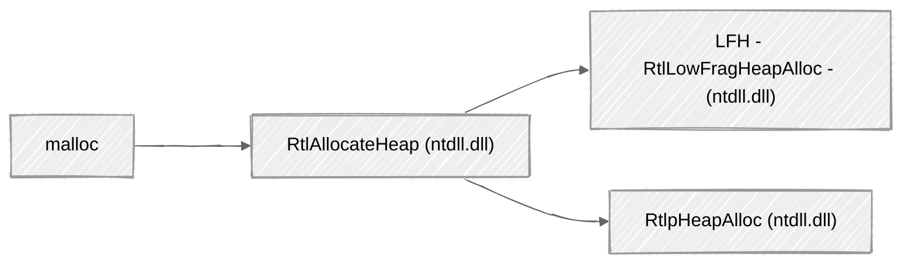

# Legacy NT Heap

Created: May 10, 2025 9:44 AM

The NT heap is the legacy implementation within windows, all the applications before Windows 10 made use of NT heap as Segment Heap mechanism was introduced from Windows 10 onwards. Although Windows 10 have Segmented Heap, it doesn’t necessarily replaces the NT heap, applications can still utilize NT heap if needed. As we know, a process allocates a heap region by default, on Windows 10 the region will be allocated from Segmented Heap. Now, in this section, we will be talking about the NT heap and it’s inner working to understand how the legacy allocator works, this will help us for upcoming sections and knowing certain structures will help in understanding certain aspects better. NT heap is still in use by traditional applications and it is possible that you may encounter this while exploiting a vulnerability in such traditional application unless it is made on top of the UWP (Universal Windows Platform) applications or MSIX as these use Segment heap by default.

---

### Allocation Flow in NT Heap

It is important to understand which functions are involved across multiple DLLs during the allocation/free request of a memory from a user-mode application. The whole workflow happens like follows:



This workflow is self-explanatory, at the end of the day, the main component is within the `ntdll.dll` which has the implementation for the heap based functions. The above graph represents the memory allocation in the NT heap if the LFH is enabled, if LFH is disabled, then the `RtlHeapAlloc` handles all of the necessary requests and perform the allocation.


The above graphs are very simplified version to give an idea of how allocation workflow is on windows, from here on, we will delve into the structures of the NT heap internals, as in the structures that are involved during the management of the allocated chunks. But before that, it is important to call out the Windows API function which deals with heap memory as well, as mention in the previous chapter, functions like `HeapCreate` or `HeapAlloc` also go through the `ntdll.dll`'s `Rtl..` function for the processing.  Let us understand the following structures, as for exploitation, all of these play certain roles.

But before we deep dive into structure, there is one common structure we will stumble upon the most i.e. the `_LIST_ENTRY` , this struct is used to create a doubly linked list where each node contain two pointers, `flink` for denoting the next element and a `blink` which is for the previous element. 

```c
typedef struct _LIST_ENTRY {
    struct _LIST_ENTRY *Flink;  // Pointer to the next entry in the list
    struct _LIST_ENTRY *Blink;  // Pointer to the previous entry in the list
} LIST_ENTRY;
```

In the context of Windows heap, lists of blocks (e.g., free blocks, allocated blocks, segments) are often implemented using `_LIST_ENTRY` structures. These lists can be traversed in both directions, providing efficient insertion and removal of elements, which is essential for memory management.


---

### `_HEAP`

```cpp
#include <windows.h>

typedef struct _HEAP_SEGMENT {
    // Define the _HEAP_SEGMENT structure here
} HEAP_SEGMENT;

typedef struct _HEAP_ENTRY {
    // Define the _HEAP_ENTRY structure here
} HEAP_ENTRY;

typedef struct _LIST_ENTRY {
    struct _LIST_ENTRY* Flink;
    struct _LIST_ENTRY* Blink;
} LIST_ENTRY;

typedef struct _HEAP_LOCK {
    // Define the _HEAP_LOCK structure here
} HEAP_LOCK;

typedef struct _RTLP_HEAP_COMMIT_LIMIT_DATA {
    // Define the _RTLP_HEAP_COMMIT_LIMIT_DATA structure here
} RTLP_HEAP_COMMIT_LIMIT_DATA;

typedef struct _RTL_RUN_ONCE {
    // Define the _RTL_RUN_ONCE structure here
} RTL_RUN_ONCE;

typedef struct _HEAP_COUNTERS {
    // Define the _HEAP_COUNTERS structure here
} HEAP_COUNTERS;

typedef struct _HEAP_TUNING_PARAMETERS {
    // Define the _HEAP_TUNING_PARAMETERS structure here
} HEAP_TUNING_PARAMETERS;

typedef struct _HEAP {
    HEAP_SEGMENT Segment;                       // +0x000: _HEAP_SEGMENT
    HEAP_ENTRY Entry;                           // +0x000: _HEAP_ENTRY
    unsigned long SegmentSignature;            // +0x010: unsigned long
    unsigned long SegmentFlags;                // +0x014: unsigned long
    LIST_ENTRY SegmentListEntry;               // +0x018: _LIST_ENTRY
    struct _HEAP* Heap;                        // +0x028: _HEAP *
    void* BaseAddress;                         // +0x030: void *
    unsigned long NumberOfPages;               // +0x038: unsigned long
    HEAP_ENTRY* FirstEntry;                    // +0x040: _HEAP_ENTRY *
    HEAP_ENTRY* LastValidEntry;                // +0x048: _HEAP_ENTRY *
    unsigned long NumberOfUnCommittedPages;    // +0x050: unsigned long
    unsigned long NumberOfUnCommittedRanges;   // +0x054: unsigned long
    unsigned short SegmentAllocatorBackTraceIndex; // +0x058: unsigned short
    unsigned short Reserved;                   // +0x05a: unsigned short
    LIST_ENTRY UCRSegmentList;                 // +0x060: _LIST_ENTRY

    // Core Heap Flags (Behavior and Debugging Flags Group)
    unsigned long Flags;                       // +0x070: unsigned long
    unsigned long ForceFlags;                  // +0x074: unsigned long
    unsigned long CompatibilityFlags;          // +0x078: unsigned long
    unsigned long EncodeFlagMask;              // +0x07c: unsigned long
    HEAP_ENTRY Encoding;                       // +0x080: _HEAP_ENTRY

    // Memory Thresholds & Interceptor Flags Group
    unsigned long Interceptor;                 // +0x090: unsigned long
    unsigned long VirtualMemoryThreshold;      // +0x094: unsigned long
    unsigned long Signature;                   // +0x098: unsigned long
    unsigned __int64 SegmentReserve;           // +0x0a0: unsigned __int64
    unsigned __int64 SegmentCommit;            // +0x0a8: unsigned __int64
    unsigned __int64 DeCommitFreeBlockThreshold; // +0x0b0: unsigned __int64
    unsigned __int64 DeCommitTotalFreeThreshold; // +0x0b8: unsigned __int64

    // Free Block & Allocation Group
    unsigned __int64 TotalFreeSize;            // +0x0c0: unsigned __int64
    unsigned __int64 MaximumAllocationSize;    // +0x0c8: unsigned __int64

    unsigned short ProcessHeapsListIndex;      // +0x0d0: unsigned short
    unsigned short HeaderValidateLength;       // +0x0d2: unsigned short
    void* HeaderValidateCopy;                  // +0x0d8: void *
    unsigned short NextAvailableTagIndex;      // +0x0e0: unsigned short
    unsigned short MaximumTagIndex;           // +0x0e2: unsigned short
    void* TagEntries;                          // +0x0e8: _HEAP_TAG_ENTRY *
    LIST_ENTRY UCRList;                        // +0x0f0: _LIST_ENTRY

    // Memory Alignment Group
    unsigned __int64 AlignRound;               // +0x100: unsigned __int64
    unsigned __int64 AlignMask;                // +0x108: unsigned __int64

    // Virtual Allocated Blocks & Segment Management Group
    LIST_ENTRY VirtualAllocdBlocks;            // +0x110: _LIST_ENTRY
    LIST_ENTRY SegmentList;                    // +0x120: _LIST_ENTRY

    unsigned short AllocatorBackTraceIndex;    // +0x130: unsigned short
    unsigned long NonDedicatedListLength;      // +0x134: unsigned long
    void* BlocksIndex;                         // +0x138: void *
    void* UCRIndex;                            // +0x140: void *
    void* PseudoTagEntries;                    // +0x148: _HEAP_PSEUDO_TAG_ENTRY *
    LIST_ENTRY FreeLists;                      // +0x150: _LIST_ENTRY

    // Heap Lock Management Group
    HEAP_LOCK* LockVariable;                   // +0x160: _HEAP_LOCK *
    long (__cdecl* CommitRoutine)(void*, void**, unsigned __int64*); // +0x168: CommitRoutine

    // Initialization and Commit Limit Group
    RTL_RUN_ONCE StackTraceInitVar;            // +0x170: _RTL_RUN_ONCE
    RTLP_HEAP_COMMIT_LIMIT_DATA CommitLimitData; // +0x178: _RTLP_HEAP_COMMIT_LIMIT_DATA
    void* UserContext;                         // +0x188: void *
    unsigned __int64 Spare;                    // +0x190: unsigned __int64

    // Front-End Heap Configuration Group
    void* FrontEndHeap;                        // +0x198: void *
    unsigned short FrontHeapLockCount;         // +0x1a0: unsigned short
    unsigned char FrontEndHeapType;            // +0x1a2: unsigned char
    unsigned char RequestedFrontEndHeapType;   // +0x1a3: unsigned char
    unsigned short* FrontEndHeapUsageData;     // +0x1a8: unsigned short *
    unsigned short FrontEndHeapMaximumIndex;   // +0x1b0: unsigned short
    unsigned char FrontEndHeapStatusBitmap[129]; // +0x1b2: unsigned char[129]

    // Status Flags Group (ReadOnly & Internal Flags)
    unsigned char ReadOnly;                    // +0x233: unsigned char
    unsigned char InternalFlags;               // +0x233: unsigned char

    // Counters & Tuning Parameters Group
    HEAP_COUNTERS Counters;                    // +0x238: _HEAP_COUNTERS
    HEAP_TUNING_PARAMETERS TuningParameters;   // +0x2b0: _HEAP_TUNING_PARAMETERS
} HEAP;

```

This structure is primary core structure of the heap that keep tracks of the heap state, it has many field that keep flags and certain objects which is needed for seamless working during allocation, there are few objects which plays certain role in the exploitation, first we must understand the core heap fields, when you spawn a normal program which does not even perform any dynamic memory allocation, even then a default region is used so you can make use of `dx (ntdll!_HEAP*)<addr>` , it will show how following objects are in use by the heap which has been allocated. Now coming to the objects of the `_HEAP` structure.

```cpp
    // Core heap fields
    unsigned long Flags;                       // +0x070: unsigned long
    unsigned long ForceFlags;                  // +0x074: unsigned long
    unsigned long CompatibilityFlags;          // +0x078: unsigned long
    unsigned long EncodeFlagMask;              // +0x07c: unsigned long
    HEAP_ENTRY Encoding;                       // +0x080: _HEAP_ENTRY
```

Firstly, we have the `Flags` , this member is used to specify the heap allocation options:

- `0x00000001` → `HEAP_NO_SERIALIZE`: Disables internal locking for multithreaded access (faster, unsafe unless thread-local).
- `0x00000002` → `HEAP_GROWABLE`: Heap can grow in size.
- `0x00000004` → `HEAP_GENERATE_EXCEPTIONS`: Exceptions are raised on allocation failures.
- `0x00000008` → `HEAP_ZERO_MEMORY`: All memory returned is zero-initialized.

 Next, we have `ForcedFlags` which is for specifying debugging flags, typically used when **heap debugging** is enabled (e.g., via `gflags`).  Even if the app doesn’t ask for a debug heap, these flags override it.

- `0x00001000` → Enable tail checking.
- `0x00002000` → Enable free checking.
- `0x00004000` → Heap parameter checking.
- `0x00010000` → Full heap tagging.

 Subsequently, the `CompatabilityFlags` is used to specify flags which may enable the legacy options for the heap allocations such as not merging heaps or disabling front-end allocators. Now, we are coming to the most important one from the core fields, this field is one of the modern mitigations imposed on heap for countering heap exploitation techniques, these fields are:

`EncodeFlagMask` →  this field accepts a bitmask which is to specify which header fields of heap to be encoded via the (XOR). This is prevent tampering of the heap metadata and prevent exploitation techniques which relied on it. 

`Encoding` →  this is the XOR key which is used for encoding the heap metadata. As mentioned earlier, this encoding is done to prevent heap header field tampering. 

---

```cpp
    // Memory Thresholds & Interceptor Flags Group
    unsigned long Interceptor;                 // +0x090: unsigned long
    unsigned long VirtualMemoryThreshold;      // +0x094: unsigned long
    unsigned long Signature;                   // +0x098: unsigned long
    unsigned __int64 SegmentReserve;           // +0x0a0: unsigned __int64
    unsigned __int64 SegmentCommit;            // +0x0a8: unsigned __int64
    unsigned __int64 DeCommitFreeBlockThreshold; // +0x0b0: unsigned __int64
    unsigned __int64 DeCommitTotalFreeThreshold; // +0x0b8: unsigned __int64
```

These fields are for having memory thresholds to ensure that the memory region does not cap all the resources within the system or break the allocator in any way. The `Interceptor` has not been documented and not something as an attacker we tend to care but after digging into the usage (thanks to ReactOS), it seems to be used for debugging purpose. Now, the `VirtualMemoryThreshold` this field is used to specify the threshold for the heap size above which `VirtualAlloc` will be used to allocate memory region for the usage. If the value of this field is `0xff00` , then any size requested above this will be allocated via `VirtualAlloc` function. `Signature` holds a magic value which is to validate the structure of real heap region. Corruption of this field will result in error as it will indicate that something is wrong with the heap or allocator.  `SegmentReserve` and `SegmentCommit` is for the reserve (1MB) and committed (8KB) space respectively in the heap segment. The `DeCommitFreeBlockThreshold` and `DeCommitTotalFreeThreshold` is the threshold value to decommit the memory space for the small free block (1KB) and next is the threshold to decommit the total free space (4KB)

---

---

Now, we will look into the free list tracking, free lists were/are one of the common object that is targeted during heap exploitation and probably during your own research you must have stumbled upon a term called “Unsafe Unlinking” , although mitigated in modern system, it was one of the best way to gain arbitrary write during the heap exploitation:

```cpp
    // Free Block & Allocation Group
    unsigned __int64 TotalFreeSize;            // +0x0c0: unsigned __int64
    unsigned __int64 MaximumAllocationSize;    // +0x0c8: unsigned __int64

    unsigned short ProcessHeapsListIndex;      // +0x0d0: unsigned short
    unsigned short HeaderValidateLength;       // +0x0d2: unsigned short
    void* HeaderValidateCopy;                  // +0x0d8: void *
    unsigned short NextAvailableTagIndex;      // +0x0e0: unsigned short
    unsigned short MaximumTagIndex;           // +0x0e2: unsigned short
    void* TagEntries;                          // +0x0e8: _HEAP_TAG_ENTRY *
    LIST_ENTRY UCRList;                        // +0x0f0: _LIST_ENTRY
```

The `TotalFreeSize` is for the sum of all free block sizes within the allocator, it helps in debugging. Next is `MaximumAllocationSize` , this is to specify the largest single allocation request the heap can process. The `ProcessHeapListIndex` is for index for the process heap, the next ones are important one to cover up as they are also part of mitigations imposed on modern systems, they are used for heap metadata validation which you might have guessed from the name of the fields itself. The `HeaderVlidateLength` holds the length of the next element which is `HeaderValidateCopy` which is a pointer that supposedly copy some of the validated header to perform consistency and corruption checking. The `NextAvailableTagIndex` holds the index of next available tag that can be used for next tag based allocation. `MaximumTagIndex` is for denoting the  maximum number of tags supported for tracking different allocation types in this heap. The `TagEntries` is a pointer to an array of tag entries (`_HEAP_TAG_ENTRY`) used to track statistics (e.g., size, count) per tag. `UCRList` is a linked list of uncommitted memory ranges in the heap. These are areas reserved by the heap but not yet committed (i.e., no physical memory backing them yet).

---

```cpp
 // Memory Alignment Group
    unsigned __int64 AlignRound;               // +0x100: unsigned __int64
    unsigned __int64 AlignMask;                // +0x108: unsigned __int64

    // Virtual Allocated Blocks & Segment Management Group
    LIST_ENTRY VirtualAllocdBlocks;            // +0x110: _LIST_ENTRY
    LIST_ENTRY SegmentList;                    // +0x120: _LIST_ENTRY

    unsigned short AllocatorBackTraceIndex;    // +0x130: unsigned short
    unsigned long NonDedicatedListLength;      // +0x134: unsigned long
    void* BlocksIndex;                         // +0x138: void *
    void* UCRIndex;                            // +0x140: void *
    void* PseudoTagEntries;                    // +0x148: _HEAP_PSEUDO_TAG_ENTRY *
    LIST_ENTRY FreeLists;                      // +0x150: _LIST_ENTRY
```

- `AlignRound`holds the value used to round up allocation sizes to enforce a specific alignment boundary (e.g., 8-byte or 16-byte aligned). The`AlignMask`  holds the mask value used in conjunction with `AlignRound` to efficiently calculate aligned addresses. Common bit-manipulation technique for alignment.
- `VirtualAllocdBlocks` is a linked list of memory blocks allocated directly via `VirtualAlloc` (bypassing regular heap management). Typically used for large allocations. The`SegmentList` is a linked list of `_HEAP_SEGMENT` structures representing all segments that belong to this heap. Each segment manages part of the heap’s memory. `AllocatorBackTraceIndex` holds the index used by debugging tools to trace where allocations originate (heap debugging / user mode stack trace info).
- `NonDedicatedListLength`holds the length of the free list that is not bound to a specific allocation size — used in Low Fragmentation Heap (LFH) or coalesced allocations.`BlocksIndex` is a pointer to a structure used to track heap blocks (e.g., binary tree, table, etc.). Helps quickly locate or index allocated/free blocks.`UCRIndex`is similar to `BlocksIndex`, but for uncommitted memory ranges (`UCR`). Allows fast lookup and manipulation. The`PseudoTagEntries` is a pointer to tag entries used in debug or pseudo-tagged allocations. This helps in tracking and analyzing heap usage patterns, not something that concern us.

---

```cpp
  // Heap Lock Management Group
    HEAP_LOCK* LockVariable;                   // +0x160: _HEAP_LOCK *
    long (__cdecl* CommitRoutine)(void*, void**, unsigned __int64*); // +0x168: CommitRoutine

    // Initialization and Commit Limit Group
    RTL_RUN_ONCE StackTraceInitVar;            // +0x170: _RTL_RUN_ONCE
    RTLP_HEAP_COMMIT_LIMIT_DATA CommitLimitData; // +0x178: _RTLP_HEAP_COMMIT_LIMIT_DATA
    void* UserContext;                         // +0x188: void *
    unsigned __int64 Spare;                    // +0x190: unsigned __int64
```

The `LockVariable` field holds a pointer to the `HEAP_LOCK` structure, which is typically a `RTL_CRITICAL_SECTION` , as the name implies it is used to manage the heap synchronization among different threads. This flag ensures that two different threads having cannot concurrently modify heap in a way that could cause corruption or inconsistencies. The `CommitRoutine`  is a function pointer to a custom commit routine, which is used by the heap to handle the process of committing additional memory as needed. The `StackTraceInitVar` ensures the initialization routines are only executed once during a process’ lifetime. `CommitLimitData`  structure contains information about the commit limits for the heap. It tracks how much memory the heap can commit, how much it will attempt to commit when running out of memory, and thresholds for committing more memory. `UserContext` is a user-defined pointer that allows the heap manager to associate arbitrary data with a particular heap instance. The `Spare` field is reserved for future use or for ensuring the alignment, it does not affect our exploitation process.

<aside>
💡

Some of these fields are very important and cannot be blindly corrupted as it could lead to major issues in how the application will behave after corruption.

</aside>

---

```cpp
    // Front-End Heap Configuration Group
    void* FrontEndHeap;                        // +0x198: void *
    unsigned short FrontHeapLockCount;         // +0x1a0: unsigned short
    unsigned char FrontEndHeapType;            // +0x1a2: unsigned char
    unsigned char RequestedFrontEndHeapType;   // +0x1a3: unsigned char
    unsigned short* FrontEndHeapUsageData;     // +0x1a8: unsigned short *
    unsigned short FrontEndHeapMaximumIndex;   // +0x1b0: unsigned short
    unsigned char FrontEndHeapStatusBitmap[129]; // +0x1b2: unsigned char[129]
```

The above fields are part of front end allocators (e.g. Low Fragmented Heap), LFH itself needs it’s own separate page and we will discuss it in later chapters. For now, let’s understand the fields that are part of the `_HEAP` structure as it denotes that the heap object utilizes LFH or not, if it does how it is structured out. The `FrontEndHeap` points to the front end allocator. The `FrontHeapLockCount` is used to count how many of the front end heap is locked to prevent simultaneous operations. `FrontEndHeapType` denotes whether the front end heap allocator is active or not, if it is `0` it is not in use and if `1` it is using look-aside list which is now a legacy mechanism and `2` is for Low Fragmented Heap and rarely it is used for `3` which is for VS segmented heap. `RequestedFrontEndHeapType` refers the allocator requested. `FrontEndHeapUsageData` tacks how the front end allocator is being used, usually it is like a pointer to array for stats. `FrontEndHeapMaximumIndex` denotes the maximum class index front end supports. `FrontEndHeapStatusBitmap` is bitmap for marking the size classes that are in use by frontend heap.

---

```cpp
    // Status Flags Group (ReadOnly & Internal Flags)
    unsigned char ReadOnly;                    // +0x233: unsigned char
    unsigned char InternalFlags;               // +0x233: unsigned char

    // Counters & Tuning Parameters Group
    HEAP_COUNTERS Counters;                    // +0x238: _HEAP_COUNTERS
    HEAP_TUNING_PARAMETERS TuningParameters;   // +0x2b0: _HEAP_TUNING_PARAMETERS
```

Now, these 4 fields are self-explanatory, but going through it `ReadOnly` is used to denote that the heap itself is read-only. `InternalFlags` are used for tracking internal state by specified flags. `Counters` for tracking runtime stats of allocations, frees, commits etc. Lastly, the `TuningParameters` adjusts thresholds like commit sizes or threshold for switching `VirtualAlloc` .

---

In above, we went through all the fields of the `_HEAP` object and understood (hopefully) some of the fields that we as an attacker would find concerning to us for exploitation. To give a brief summary, every heap object that gets allocated within a process’ lifetime, it will be of `_HEAP` object, this object has multiple core fields which specified the heap’s properties, several other fields within this object holds significant value as well such as threshold or the type of allocator currently used. Nonetheless, it is important to understand this structure closely as during exploitation, this will open avenues and we will need to know certain fields to debug and precisely work on our exploitation approach. 

Before we conclude this chapter, we will go ahead and compile the following `malloc_heap_struct.c` file and check the `_HEAP` object via WinDBG:

```c
#include <Windows.h>
#include <stdio.h>
#include <stdlib.h>  // for malloc

/* Compile Command:  cl.exe /W4 /EHsc /Zi check_ntheap.c /link /debug */

int main() {
    char* hello = (char*)malloc(20);
    if (hello == NULL) {
        printf("malloc failed\n");
        return 1;
    }

    printf("Heap: %p\n", hello);
    getch();
    free(hello);
    return 0;
}

```


---

### `_HEAP_SEGMENT`

This structure represents a contiguous memory region on the heap.


```c
typedef struct _HEAP_SEGMENT {
    HEAP_ENTRY Entry;                           // Offset 0x000: First heap entry (metadata)
    ULONG SegmentSignature;                     // Offset 0x010: Signature (e.g., 0xFFEEFFEE)
    ULONG SegmentFlags;                         // Offset 0x014: Flags (e.g., growable, user-mode, etc.)
    LIST_ENTRY SegmentListEntry;                // Offset 0x018: Linked list of segments
    struct _HEAP *Heap;                         // Offset 0x028: Pointer back to the owning heap
    PVOID BaseAddress;                          // Offset 0x030: Base address of segment
    ULONG NumberOfPages;                        // Offset 0x038: Total number of pages
    PHEAP_ENTRY FirstEntry;                     // Offset 0x040: First usable heap entry in segment
    PHEAP_ENTRY LastValidEntry;                 // Offset 0x048: End of valid entries
    ULONG NumberOfUnCommittedPages;             // Offset 0x050: Pages reserved but not committed
    ULONG NumberOfUnCommittedRanges;            // Offset 0x054: Count of uncommitted ranges
    USHORT SegmentAllocatorBackTraceIndex;      // Offset 0x058: For debug tracing
    USHORT Reserved;                            // Offset 0x05A: Padding / reserved
    LIST_ENTRY UCRSegmentList;                  // Offset 0x060: Uncommitted range list
} HEAP_SEGMENT, *PHEAP_SEGMENT;
```

- `Entry`: This field is to specify the initial heap entry marking the segment's start.
- `SegmentSignature`: This field Identifies the segment type.
- `SegmentFlags`: Flags in this field indicates segment properties.
- `SegmentListEntry`: This field is of type `LIST_ENTRY` which links to other segments in the heap.
- `Heap`: This is a pointer to the owning `_HEAP` structure to which the segment belongs to.
- `BaseAddress`: This is the starting address of the segment.
- `NumberOfPages`: This field denotes the total pages in the segment.
- `FirstEntry` & `LastValidEntry`: Pointers to the first and last valid entries in the segment.
- `NumberOfUnCommittedPages`: This field specifies the count of uncommitted pages.
- `UCRSegmentList`: List of uncommitted range

---

## `_HEAP_ENTRY`

This structure is something we will deal with the most during overflow exploitation within heap areas, it is important to understand these layout as it will help in crafting a precise exploitation path. This structure denotes an allocated entry within the heap segment.


```c
typedef struct _HEAP_ENTRY {
    union {
        struct {
            USHORT Size;              // Offset 0x00: Size of block (in 8-byte units)
            UCHAR Flags;              // Offset 0x02: Flags like BUSY, LAST_ENTRY, etc.
            UCHAR SmallTagIndex;      // Offset 0x03: Tag for tracking allocations
        };
        ULONGLONG CompactHeader;      // Offset 0x00: Encoded header (combined)
    };

    union {
        struct {
            USHORT PreviousSize;      // Offset 0x04: Size of previous block
            UCHAR SegmentOffset;      // Offset 0x06: Offset into segment
            UCHAR UnusedBytes;        // Offset 0x07: Unused bytes at end of allocation
        };
        ULONGLONG ExtendedInfo;       // Offset 0x04: Used if HEAP_ENTRY_EXTRA_PRESENT
    };
} HEAP_ENTRY, *PHEAP_ENTRY;

```

- `Size`: This field denotes the size of the allocation in heap granularity units.
- `Flags`: This field indicates the state of the entry (e.g., busy, free). (marking whether the memory region is in use or has been freed for reallocation)
- `SmallTagIndex`: This field specified tag for tracking allocations.
- `SubSegmentCode`: This field is used in LFH for subsegment identification.
- `PreviousSize`: This field indicates the size of the previous heap entry in the segment.
- `SegmentOffset`: This field contains the offset within the segment.

---

## `_HEAP_FREE_ENTRY`

This is basically an specialized version of the previous structure and used for free blocks, it is also one of the important structure that we must be aware of as we will see how this can help us during exploitation.


```c
typedef struct _HEAP_FREE_ENTRY {
    union {
        struct {
            USHORT Size;
            UCHAR Flags;
            UCHAR SmallTagIndex;
        };
        ULONGLONG CompactHeader;
    };
    union {
        struct {
            USHORT PreviousSize;
            UCHAR SegmentOffset;
            UCHAR UnusedBytes;
        };
        ULONGLONG ExtendedInfo;
    };
    LIST_ENTRY FreeList;              // Doubly linked list (next, prev pointers)
} HEAP_FREE_ENTRY, *PHEAP_FREE_ENTRY;

```

- `FreeList`: This field links to other free entries in the same size class.
- `FreeListBlink`: This field contains the backward link in the free list.
- `FreeListFlink`: This filed contains the forward link in the free list

---

## `_HEAP_LIST_LOOKUP`

This struct is used to manage the list lookup which in turn helps in easier access and management of the blocks.

```c
typedef struct _HEAP_LIST_LOOKUP {
    USHORT ExtendedLookup;
    ULONG ArraySize;                   // Size of list
    PHEAP_FREE_ENTRY *FreeLists;      // Array of freelist heads
    ULONG FreeListHints[128];         // Hinting mechanism for quick lookup
} HEAP_LIST_LOOKUP, *PHEAP_LIST_LOOKUP;

```

- `ExtendedLookup`: This is a pointer to additional lookup structures.
- `ArraySize`: This specifies the size of the lookup array.
- `ItemCount`: This specifies the number of items currently in the lookup.
- `OutOfRangeItems`: This field is used to keep the count of items not fitting in the standard lookup.

---

## `HEAP_UNPACKED_ENTRY`


This structure is used for debugging purpose and can come in handy during reverse engineering process or for our exploitation as well, the fields of this struct are same as of the `_HEAP_ENTRY` and `_HEAP_FREE_ENTRY`

```c
typedef struct _HEAP_UNPACKED_ENTRY {
    USHORT Size;
    UCHAR Flags;
    UCHAR SmallTagIndex;
    USHORT PreviousSize;
    UCHAR SegmentOffset;
    UCHAR UnusedBytes;
} HEAP_UNPACKED_ENTRY, *PHEAP_UNPACKED_ENTRY;

```

- `Size`: This field specifies the size of the allocation.
- `Flags`: This specifies the status flags for the allocation.
- `SmallTagIndex`: This denotes the tag for tracking purposes.

Other fields are self-explanatory and already discussed.

---

## `HEAP_VIRTUAL_ALLOC_ENTRY`

This struct is something you may not encounter but for the sake of the documentation and making sure this serves as an absolute guide, it is explained as follows. This structure is used to represent a memory which was very large and has been allocated via `VirtualAlloc` instead of the heap manager.

```c
typedef struct _HEAP_VIRTUAL_ALLOC_ENTRY {
    LIST_ENTRY Entry;              // +0x00: Doubly linked list (VirtualAllocdBlocks)
    SIZE_T ExtraStuff;            // +0x10: Usually alignment/padding or flags
    PVOID CommitAddress;          // +0x18: Base address of committed memory
    SIZE_T CommitSize;            // +0x20: Amount of committed memory
    SIZE_T ReserveSize;           // +0x28: Amount of reserved memory
    HEAP_ENTRY BusyBlock;         // +0x30: Fake heap block representing this VA region
} HEAP_VIRTUAL_ALLOC_ENTRY, *PHEAP_VIRTUAL_ALLOC_ENTRY;

```

- `Entry`: This specifies the heap entry structure for the allocation.
- `CommitSize`: This specifies the size of committed memory.
- `ReserveSize`: This field represents the total reserved size.
- `CommitAddress` : This field specifies the base address of the committed memory.
- `BusyBlock` : This is a heap block specified to ensure that the allocated memory is treated as a heap block.

---

## `_HEAP_LOCK`

```c
typedef struct _HEAP_LOCK {
    union {
        RTL_CRITICAL_SECTION CriticalSection;  // For serialized heaps
        FAST_MUTEX FastMutex;                  // For low-contention heaps
    };
} HEAP_LOCK, *PHEAP_LOCK;

```

This structure used to **synchronize access to heap structures**, ensuring **thread-safe** operations during allocations and deallocations. In multithreaded environments, this prevents **race conditions, corruption, or double frees** that could arise if two threads manipulate the same heap concurrently.

